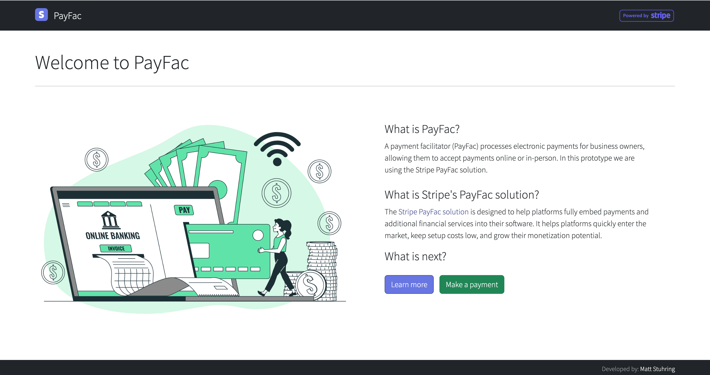

# React Stripe Payment Prototype



## Description

Learn Stripe payments by building a React/Express prototype following guidance provided by [Stripe documentation](https://stripe.com/docs/payments/quickstart).

## Getting Started

This project was bootstrapped with [Create React App v5](https://github.com/facebookincubator/create-react-app). Then an Express server was added in the `server` directory. The server is proxied via the `proxy` key in `package.json`.

### Dependencies

Client:
- React v18
- React Router Dom v6
- Bootstrap v5
- React Stripe JS v1
- Stripe JS v1

Server:
- NodeJS v16
- Express v4
- Stripe v11

## Using this project

1. Clone the project, change into the directory and install the dependencies.

   ```bash
   $ git clone https://github.com/mattstuhring/react-express-starter-app.git
   $ cd react-express-starter-app
   $ npm install
   $ cd client
   $ npm install
   $ cd .. && cd server
   $ npm install
   ```

2. Add your stripe keys which can be found here: https://dashboard.stripe.com/apikeys
  - Create `.env` file in `/server` directory, and add your `STRIPE_SECRET_KEY` following `.env.example`.
  - If required, update `STRIPE_PUBLIC_KEY` in the React `Payment` component located in the `/client` directory.
 
3. Start the server.

   You can start dev servers in the root directory using the command:

   ```bash
   $ npm start
   ```

   Runs the React app in develop mode on port 3000 and the server on port 3001 in the same terminal window using [concurrently](https://www.npmjs.com/package/concurrently).

## Testing

On the payment screen, to confirm that your integration works correctly, simulate transactions without moving any money, using special values in test mode. More details can be found in the (Stripe documentation)[https://stripe.com/docs/testing].

ex. Credit Card

```
Country: United States (US)
Brand: Visa
Number: 4242424242424242
Exp Date: 12/34
CVC: 123
```

## Authors

Contributors names and contact info can be found here.

Matt Stuhring - https://www.linkedin.com/in/mattstuhring/

## Version History

- 0.1
  - Initial Release

## License

This project is licensed under the MIT License.
